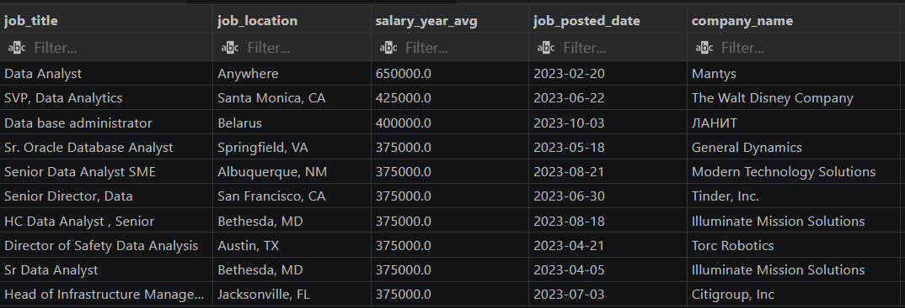

# Data Analyst Job Market Analysis

## Overview

This project explores the **Data Analyst job market** using SQL. The primary focus is to analyze **salary trends**, identify **top-paying roles**, and determine the **most in-demand skills** for data professionals. 

The goal of this analysis is to provide actionable insights for aspiring Data Analysts: discovering which skills optimize both **hiring potential** and **salary growth**.

The dataset was initially sourced from an online SQL course. While the foundational structure was provided, I developed and executed advanced custom queries—specifically utilizing Common Table Expressions (CTEs), ranking functions, and min-max normalization—to perform deeper skill and salary analysis.

---

## Key Findings

- **SQL** is overwhelmingly the most in-demand skill across the board.
- **Python** and **Tableau** frequently appear as core requirements in top-paying roles.
- The highest salaries are generally reserved for **senior-level positions** (e.g., Director, Principal), not entry-level jobs.
- Certain niche skills (like SVN or Solidity) boast high average salaries, but have extremely low job availability, making them risky to specialize in early on.
- The optimal combination of **high market demand** and **strong salary potential** is: **SQL, Python, and Tableau**.

---

## Questions This Project Answers

1. **Top Paying Jobs**: What are the highest-paying analyst roles in the market?
2. **Skill Requirements for High Earners**: What skills are required for those top-tier jobs?
3. **Market Demand**: What skills are the most requested by employers?
4. **Salary Premium**: Which specific skills are statistically linked to the highest salaries?
5. **Optimal Skillset**: Which skills offer the best balance of job availability and salary compensation?

**Tools Used:** PostgreSQL, Visual Studio Code (VS Code)

---

## 1. Top Paying Analyst Jobs

Some data roles reach extraordinary compensation levels, peaking as high as **$650,000**, with a significant cluster of top roles averaging around **$375,000**.

**Insights:**
- These are definitively **not entry-level jobs**.
- The titles typically reflect senior leadership (e.g., **Director**, **Principal**, **SVP**). 
- Compensation at this level is driven heavily by **experience**, **strategic leadership**, and **direct business impact** rather than just technical execution.

---

## 2. Skills Required for Top Paying Jobs

| Count of Skill | Top Skill |
|---:|---|
| 58 | Python |
| 52 | SQL |
| 34 | Tableau |
| 32 | R |
| 18 | SAS |
| 15 | Excel |
| 10 | Power BI |
| 10 | Spark |
| 9 | AWS |
| 8 | Snowflake |

**Insights:**
- For the highest-paying roles, **Python** and **SQL** dominate the requirements.
- **Python** appears slightly more frequently than SQL, indicating its immense value at advanced, analytical levels.  
- **Tableau** outpaces **Power BI** for senior data roles.
- The presence of tools like **AWS**, **Spark**, and **Snowflake** suggests that elite analysts are expected to understand data architecture and engineering systems, not just data visualization.

---

## 3. Most In-Demand Skills Across All Jobs

| Top Skill | Count of Skill |
|---|---:|
| SQL | 92,628 |
| Excel | 67,031 |
| Python | 57,326 |
| Tableau | 46,554 |
| Power BI | 39,468 |

**Insights:**
- Looking at the broader job market, **SQL** is by far the most requested skill.
- **Excel** remains heavily relied upon, ranking higher than Python in overall volume.
- **The Career Progression Pattern:**
  - **Excel** provides the baseline entry point.
  - **SQL** is the mandatory foundation for most data roles.
  - **Python** serves as the bridge to advanced, higher-paying opportunities.

---

## 4. Skills Linked to the Highest Salaries

| Top Skill | Average Salary |
|---|---:|
| SVN | $400,000 |
| Solidity | $179,000 |
| Couchbase | $160,515 |
| DataRobot | $155,486 |
| Golang | $155,000 |
| MXNet | $149,000 |
| dplyr | $147,633 |
| VMware | $147,500 |
| Terraform | $146,734 |
| Twilio | $138,500 |

**Insights:**
- The absolute highest average salaries are often tied to highly **niche skills** (e.g., SVN, Solidity, Couchbase).
- **The Catch:** While these skills pay exceptionally well, the total volume of job openings requiring them is extremely low.
- Pursuing these skills early in a career represents a high-risk, high-reward strategy that is generally not recommended for junior analysts.

---

## 5. The Best Skills to Learn (Demand & Salary Balance)

| Skill Name | Job Count | Avg Salary | Normalization Score |
|---|---:|---:|---:|
| SQL | 3,892 | $100,299 | 0.7292 |
| Python | 2,304 | $105,115 | 0.5634 |
| Tableau | 2,155 | $101,543 | 0.5154 |
| Perl | 26 | $133,929 | 0.5019 |
| Kafka | 54 | $128,983 | 0.4657 |
| Excel | 2,467 | $88,924 | 0.4540 |
| PyTorch | 26 | $124,956 | 0.4297 |
| R | 1,337 | $102,371 | 0.4167 |
| Airflow | 100 | $121,658 | 0.4127 |
| TensorFlow | 31 | $122,242 | 0.4085 |

**Insights:**
- To objectively identify the best skills to learn, I applied a **min-max normalization** algorithm balancing job availability against average salary.
- The optimal "Big Three" skills are clear: **SQL, Python, and Tableau**.
- Focusing on these three technologies provides the highest probability of securing a job while maintaining strong earning potential.

---

## What I Learned

Executing this project enhanced my technical SQL proficiency and my understanding of labor market dynamics.

- **Advanced SQL:** I constructed complex queries utilizing **CTEs** (Common Table Expressions), **JOINs**, and aggregation functions to synthesize large datasets.
- **Mathematical Application in SQL:** I developed a normalization scoring system directly within PostgreSQL to rank skills based on multiple weighted variables.
- **Analytical Thinking:** I translated raw data into actionable business and career intelligence.

**Main Takeaway:**  
**SQL** is the non-negotiable foundation, **Python** unlocks advanced analytics and automation, and **Tableau** is essential for translating data into digestible business decisions.

---

## Conclusion & Recommendations

For aspiring Data Analysts aiming to maximize employability and income:

1. **Avoid the Niche Trap:** Do not chase rare, high-paying skills (like Solidity or Golang) early in your career. The lack of job openings makes this a risky path.
2. **Master the Core Stack:** Focus relentlessly on:
   - **SQL** (Data Extraction & Manipulation)
   - **Python** (Advanced Analysis & Scripting)
   - **Tableau** (Visualization & Storytelling)
3. **Understand Excel's Place:** While Excel is ubiquitous and necessary, relying on it alone will artificially cap your salary potential.

Mastering this core stack provides the strongest statistical probability for long-term career growth and income scaling.